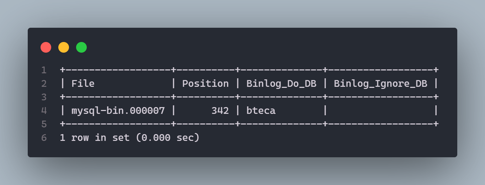
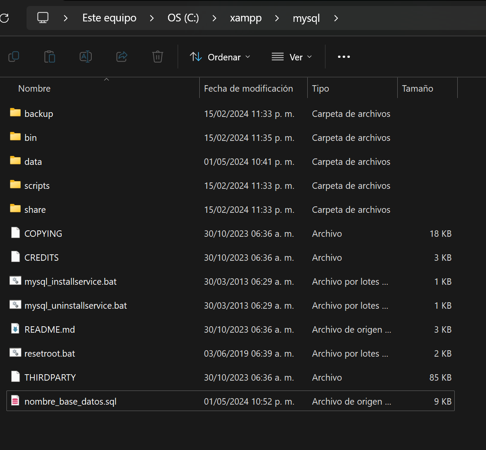

# Configuracion de Servidores **MySQL en modo espejo** 

A continuacion se presentan los pasos a seguir para configurar un servidor maestro y dos esclavos usando el **SGBD MySQL**. 

## Configuracion del servidor **Maestro** 

Lo siguiente se debera realizar en el equipo de computo que funcionara como servidor maestro. 

Buscar y acceder al archivo `my.ini` ubicado en la carpeta por defecto de *XAMPP* o la carpeta de instalacion de **MySQL** 

> La carpeta predeterminada de MySQL cuando se usa **XAMPP** es `c:\xampp\mysql\bin\` 

Dentro del archivo `my.ini`, buscar la linea donde este **`server-id`** y escribir lo siguiente. 

~~~ini
server-id=1
binlog-do-db=dbname
log-bin=mysql-bin
max_allowed_packet=16M
~~~ 

> `dbname` sera el nombre de la base de datos a la que se quiera crear el espejo 

A continuacion se debe ***reiniciar el servidor de MYSQL*** 

> Terminado lo anterior iniciar el servidor e iniciar sesion en **MySQL**.
>> Para iniciar sesion `mysql -u root -p`

### Creacion de los esclavos

Siguiendo en el equipo que funciona como servidor maestro iniciar sesion. 

Una vez iniciada sesion como ***root*** copiar y pegar el siguiente codigo. 

> `nombre_base_datos` es el nombre de la base de datos a la que se le quiere crear el espejo 

#### Usuario para esclavo 1 

```sql
CREATE USER 'esclavo1'@'localhost' IDENTIFIED BY '1234';

GRANT ALL ON nombre_base_datos.* TO 'esclavo1'@'localhost';

GRANT REPLICATION SLAVE ON *.* TO 'esclavo1'@'%' IDENTIFIED BY '1234';

FLUSH PRIVILEGES;
```

#### Usuario para esclavo 2 

```sql
CREATE USER 'esclavo2'@'localhost' IDENTIFIED BY '1234';

GRANT ALL ON nombre_base_datos.* TO 'esclavo2'@'localhost';

GRANT REPLICATION SLAVE ON *.* TO 'esclavo2'@'%' IDENTIFIED BY '1234'

FLUSH PRIVILEGES;
```

#### Creacion del respaldo de la Base de Datos

Siguiendo con la sesion iniciada en **MySQL** hacer uso de la base de datos para crear el respaldo, se bloquearan las tablas para evitar modificaciones y errores durante la creacion del respaldo. 

```sql
use nombre_base_datos;

FLUSH TABLES WITH READ LOCK;

SHOW MASTER STATUS;

exit;
```

> El comando `SHOW MASTER STATUS;` devolvera una tabla, guardar o copiar esos valores ya que seran usados para configurar los esclavos

Al ejecuta el comando `SHOW MASTER STATUS;` devolvera una tabla como la siguiente

 

> El valor que interesa es el la columna `File` y `Position` 

Posteriormente ejecutar el siguiente comando que creara un archivo `nombre_base_datos.sql` el cual contendra la base de datos respaldada, el archivo se devera guardar en los equipos de computo esclavos, de preferencia en la raiz de *MySQL* `C:\xampp\mysql\`

```powershell
mysqldump -u root -p nombre_base_datos >   C:\xampp\mysql\nombre_base_datos.sql
```

Se creara un archivo `nombre_base_datos.sql` en la carpeta `C:\xampp\mysql\`



Conectarse de nueva cuenta como ***root*** a **MySQL**

```sql
use nombre_base_datos;

UNLOCK TABLES;
```

Con todo lo anterior se termina de configurar el servidor maestro, recordar que el archivo `nombre_base_datos.sql` que se genero se debera guardar en la misma carpeta `C:\xampp\mysql\` de los esclavos. 

## Configuracion de los Servidores Esclavos

> La siguiente configuracion aplica para ambos servidores esclavos

Iniciar sesion en los servidores esclavos como ***root*** y crear una base de datos con el nombre de la base de datos espejo. 

```sql
CREATE DATABASE nombre_base_datos;

exit;
```

Ahora se debera importar el archivo `nombre_base_datos.sql` previamente generado, recordar que el archivo debe estar en `C:\xampp\mysql\`

```powershell
mysql -u root -p nombre_base_datos <  nombre_base_datos.sql
```

### Configuracion del Esclavo 1

Buscar y acceder al archivo `my.ini` ubicado en la carpeta por defecto de *XAMPP* o la carpeta de instalacion de **MySQL** 

> La carpeta predeterminada de MySQL cuando se usa **XAMPP** es `c:\xampp\mysql\bin\` 

Dentro del archivo `my.ini`, buscar la linea donde este **`server-id`** y escribir lo siguiente. 

```ini
server-id=2
binlog-do-db=nombre_base_datos
log-bin=mysql-bin
```

> Reiniciar el servidor esclavo 1, desde el **XAMPP**, darle `stop` y despues `start`

Crear el usario correspondiente al esclavo 1. 

```sql
CREATE USER 'esclavo1'@'localhost'  IDENTIFIED BY '1234';

GRANT ALL ON nombre_base_dato.* TO 'esclavo1'@'localhost';

GRANT REPLICATION SLAVE ON *.* TO 'esclavo1'@'%'  IDENTIFIED BY ' 1234';

FLUSH PRIVILEGES;
```

Asignar la configuracion para conectarse al servidor maestro. 

```sql
CHANGE MASTER TO
MASTER_HOST='192.168.XXX.XXX',
MASTER_USER='esclavo1',
MASTER_PASSWORD='1234',
MASTER_LOG_FILE='mysql-bin.0000XX',
MASTER_LOG_POS=XXX;
```

> `MASTER_HOST` escribir la **IP** del servidor esclavo. 
> `MASTER_LOG_FILE` es el dato de la columna `File` que anteriormente se guardo. 
> `MASTER_LOG_POS` es el dato de la columna `Position` que se guardo anteriormente, **no lleva comillas**

--------------

### Configuracion del Esclavo 2

Buscar y acceder al archivo `my.ini` ubicado en la carpeta por defecto de *XAMPP* o la carpeta de instalacion de **MySQL** 

> La carpeta predeterminada de MySQL cuando se usa **XAMPP** es `c:\xampp\mysql\bin\` 

Dentro del archivo `my.ini`, buscar la linea donde este **`server-id`** y escribir lo siguiente. 

```ini
server-id=3
binlog-do-db=nombre_base_datos
log-bin=mysql-bin
```

> Reiniciar el servidor esclavo 1, desde el **XAMPP**, darle `stop` y despues `start`

Crear el usario correspondiente al esclavo 2. 

```sql
CREATE USER 'esclavo2'@'localhost'  IDENTIFIED BY '1234';

GRANT ALL ON nombre_base_dato.* TO 'esclavo2'@'localhost';

GRANT REPLICATION SLAVE ON *.* TO 'esclavo2'@'%'  IDENTIFIED BY ' 1234';

FLUSH PRIVILEGES;
```

Asignar la configuracion para conectarse al servidor maestro. 

```sql
CHANGE MASTER TO
MASTER_HOST='192.168.XXX.XXX',
MASTER_USER='esclavo1',
MASTER_PASSWORD='1234',
MASTER_LOG_FILE='mysql-bin.0000XX',
MASTER_LOG_POS=XXX;
```

> `MASTER_HOST` escribir la **IP** del servidor esclavo. 
> `MASTER_LOG_FILE` es el dato de la columna `File` que anteriormente se guardo. 
> `MASTER_LOG_POS` es el dato de la columna `Position` que se guardo anteriormente, **no lleva comillas**

-----------------
## Pasos finales

Reiniciar el servicio en ambos servidores esclavos 

> Para reiniciar el servicio del servidor MySQL, desde el **XAMPP**, darle `stop` y despues `start`


Para verificar que funcione, en el servidor maestro realizar un `INSERT` en alguna de las tablas de la base de datos, posteriormente en los servidores esclavos, habiendo iniciado sesion con los usuarios antes creados para cada esclavo realizar una operacion `SELECT` en la misma tabla de la base de datos donde se realizo el `INSERT`.